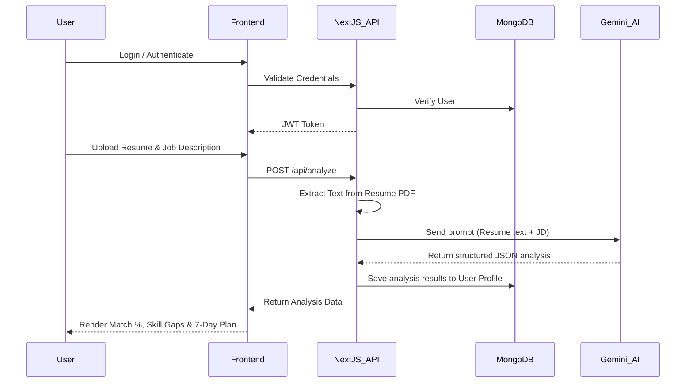

# SkillCompass

> **Direction for your career growth.**

SkillCompass is an AI-powered job-readiness platform designed to help you navigate your next career move with clarity. It securely analyzes your resume against a target job description, identifies critical skill gaps, predicts potential interview questions, and generates a personalized, step-by-step 7-day action plan to get you interview-ready.

---

## Live Demo
[View Live Demo](https://skillcompass.vercel.app) *(Replace with your actual Vercel deployment URL)*

---

## Tech Stack

- **Frontend:** Next.js 15 (App Router), React 18, Tailwind CSS, Lucide Icons
- **Backend:** Next.js Serverless API Routes
- **Database:** MongoDB (Mongoose)
- **AI Engine:** Google Gemini AI (Gemini 1.5 Flash API)
- **Authentication:** Custom secure JWT-based authentication
- **Deployment:** Vercel

---

## Way of Approach & Architecture

SkillCompass is designed with a modern, serverless architecture focusing on speed and privacy:
1. **Secure Access:** Users authenticate via a custom JWT system to access their dashboard.
2. **Data Input:** Users upload their resume (PDF format) and paste the target Job Description (JD).
3. **Automated Parsing:** The platform securely extracts text from the PDF without storing the raw file permanently.
4. **AI Processing:** The resume text and JD are passed securely to the Gemini AI engine with a highly structured prompt to enforce a strict JSON schema output.
5. **Actionable Insights:** The backend parses the AI's JSON response and delivers real-time, interactive feedback to the user's dashboard.

### Application Flow Diagram



---

## Connection & Configuration

### Prerequisites
Make sure you have [Node.js](https://nodejs.org/) installed on your machine.

### 1. Clone the repository
```bash
git clone https://github.com/your-username/skillcompass.git
cd skillcompass
```

### 2. Install dependencies
```bash
npm install
```

### 3. Environment Variables setup
Create a `.env.local` file in the root directory of the project and add the following keys:

```env
# MongoDB Connection String
MONGODB_URI=mongodb+srv://<username>:<password>@cluster0.example.mongodb.net/skillcompass?retryWrites=true&w=majority

# Secret key for JWT Authentication (can be any secure random string)
JWT_SECRET=your_super_secret_jwt_key_here

# Google Gemini API Key (Get it from Google AI Studio)
GEMINI_API_KEY=your_gemini_api_key_here
```

### 4. Run the development server
```bash
npm run dev
```

Open [http://localhost:3000](http://localhost:3000) with your browser to see the result.

---

## Contributing
Contributions are always welcome! Feel free to open issues or submit pull requests.

